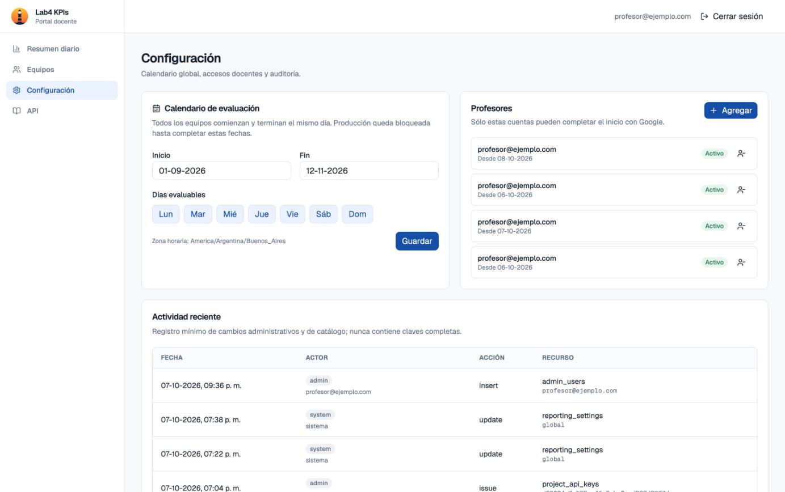
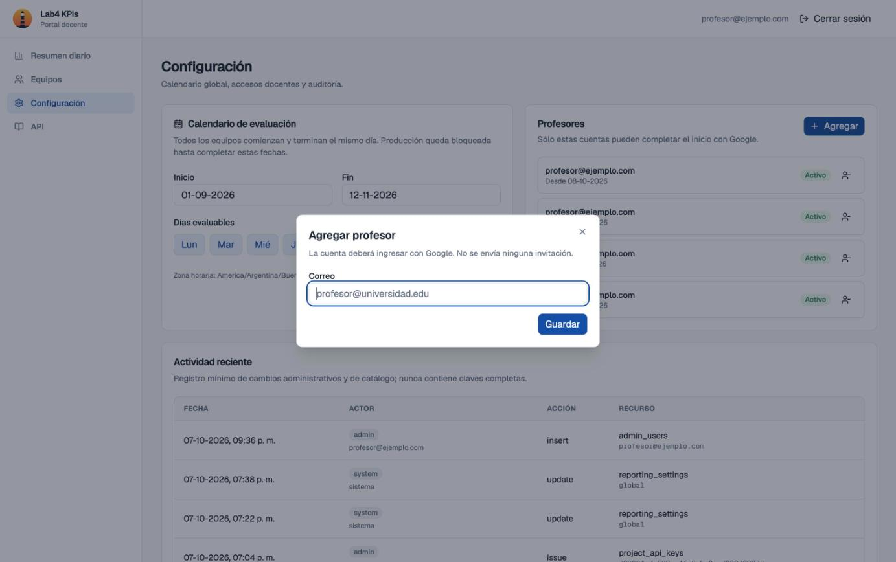
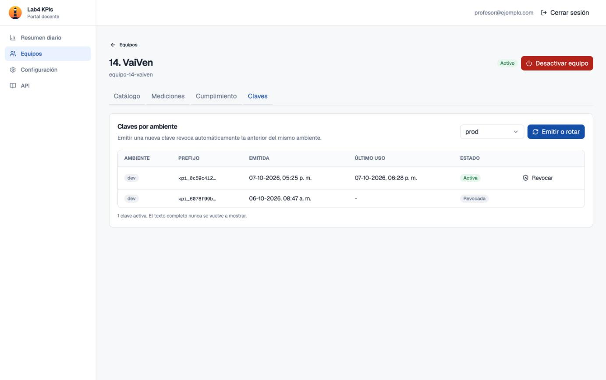
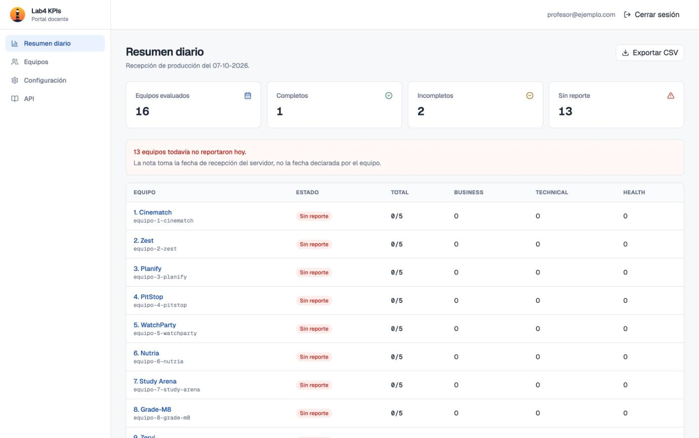
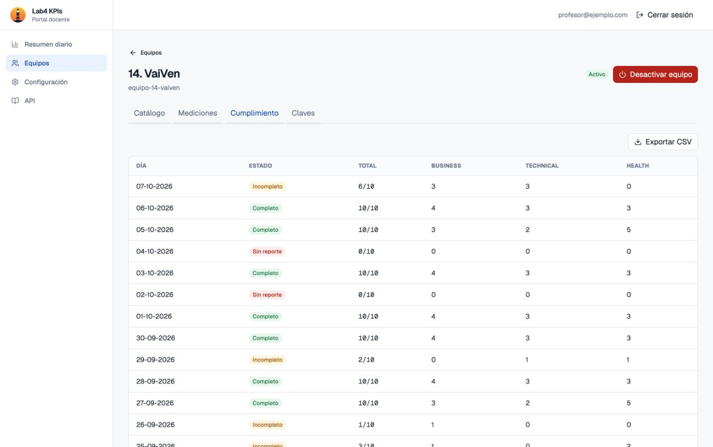
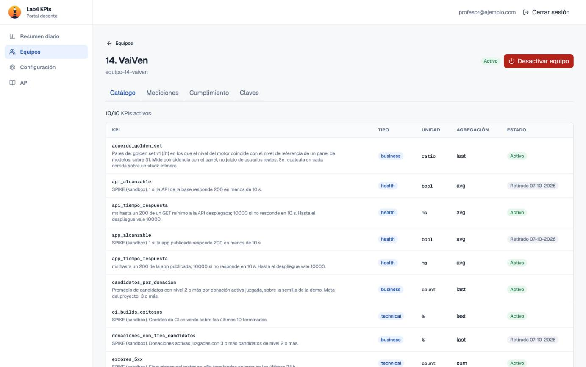

# Guía para profesores

La plataforma recibe todos los días entre 5 y 10 KPIs de cada equipo y los muestra en un portal. Esta guía cubre lo necesario para operarla sin depender de quienes la construimos.

**Portal:** [https://lab4-kpis.github.io/kpis/](https://lab4-kpis.github.io/kpis/)

## Checklist de arranque

- [ ] 1. Mandar al grupo de WhatsApp de Lab IV un Gmail por profesor y el usuario de GitHub del profesor que quede como owner.
- [ ] 2. El profesor owner acepta las invitaciones de GitHub y Supabase.
- [ ] 3. Configurar el período de evaluación.
- [ ] 4. Emitir la clave `prod` de los 16 equipos y mandarla por WhatsApp.
- [ ] 5. El primer día del período, revisar el **Resumen diario**.
- [ ] 6. *(Opcional)* Conectar el MCP a Claude Code o Codex.

Las capturas de esta guía son del portal de desarrollo, con correos reemplazados por ejemplos.


## 1. Acceso al portal

1. Mandar al grupo de WhatsApp de Lab IV:
  - **una cuenta Gmail por cada profesor** que necesite entrar al panel, a la que tenga acceso;
  - de **un profesor** que vaya a quedar como owner de la plataforma, su **usuario de GitHub** (ver paso 2).
   Nosotros habilitamos los Gmails y mandamos las invitaciones de owner.
2. Entrar al portal con **Continuar con Google**, usando esa cuenta. No hay usuario ni contraseña propios.

**Sumar o quitar a otro profesor:** ir a **Configuración → Profesores → Agregar** y cargar su correo. No se manda ninguna invitación, así que hay que avisarle que ya puede entrar. Para quitar el acceso, desactivarlo desde la misma lista. El último profesor activo no se puede desactivar.






## 2. Tomar control de la plataforma

El profesor que mandó su usuario de GitHub en el paso 1 queda como **owner** de las tres piezas. Sólo tiene que aceptar las invitaciones que le llegan:


| Pieza                                     | Qué contiene                                            | Invitación                                                |
| ----------------------------------------- | ------------------------------------------------------- | --------------------------------------------------------- |
| Organización de GitHub `lab4-kpis`        | Código, portal, contrato de datos, historial de cambios | Owner de la organización                                  |
| Proyecto Supabase                         | Base de datos, autenticación, claves                    | Owner de la organización de Supabase, al Gmail del paso 1 |
| Paquete npm `@lab4-kpis/mcp` *(opcional)* | MCP para profesores                                     | Ver [MCP_NPM_RUNBOOK.md](../MCP_NPM_RUNBOOK.md)           |


Con esto, la cátedra puede rehacer todo desde cero siguiendo [SETUP.md](../SETUP.md), sin pedirnos nada.

## 3. Configurar el período

En **Configuración → Calendario de evaluación**:

1. Completar **Inicio** y **Fin** (formato `DD-MM-YYYY`).
2. Marcar los **días evaluables**, por ejemplo de lunes a viernes.
3. **Guardar**.

Sólo se evalúan los días marcados dentro del período, en hora de Argentina y nunca a futuro. Hasta que se guarden las dos fechas, no se pueden emitir claves `prod`.

## 4. Habilitar un equipo

Los 16 equipos ya están cargados, cada uno con su referente. Los equipos ya tienen su clave `dev` y prueban contra el ambiente de testing, que no cuenta para la nota. El profesor sólo emite la clave `prod`, que es la que suma. Para cada equipo:

1. Ir a **Equipos**, abrir el equipo y entrar en la pestaña **Claves**.
2. Elegir `prod` y pulsar **Emitir o rotar**.
3. En la ventana que se abre, pulsar **Enviar por WhatsApp a PM**. Se abre WhatsApp con un mensaje listo que trae la clave y todo lo que el equipo necesita para integrarse. Enviarlo.

- La clave se ve **una sola vez**. Si el equipo la pierde o la filtra, pulsar **Emitir o rotar** de nuevo: se emite una clave nueva y la anterior deja de funcionar en el mismo momento.
- **Equipo nuevo:** en **Equipos → Nuevo equipo**, cargar número, nombre e identificador (`equipo-17-nombre`). Un equipo nuevo no tiene referente cargado, así que no aparece el botón de WhatsApp: copiar la clave y mandarla por mensaje privado.
- **Desactivar equipo** bloquea todas sus claves y **no se puede deshacer**. El historial se conserva.




## 5. Validar que los datos llegan

**Resumen diario** es la pantalla principal. Arriba aparecen los equipos **sin reporte** y, para cada equipo, cuántos KPIs válidos llegaron ese día:


| Estado      | Regla                                |
| ----------- | ------------------------------------ |
| Completo    | Todos los KPIs que propuso el equipo |
| Incompleto  | Al menos uno, pero no todos          |
| Sin reporte | Ningún KPI                           |


"Todos los KPIs que propuso" son los activos en su catálogo ese día, contando como mínimo 5 y como máximo 10: un equipo con 8 KPIs se mide contra 8 (se ve `6/8`), uno con 3 contra 5. El puntaje del día es la cantidad de KPIs válidos, con un tope de 10. Esa es la nota del challenge. Sólo cuenta `prod`, y cada KPI se asigna al día en que se **recibió**.

Todo lo que se ve es válido: la base rechaza en el momento cualquier KPI que no esté en el catálogo del equipo o que tenga un valor mal formado. Lo recibido no se puede editar ni borrar.

Para ver un equipo en detalle, abrirlo desde **Equipos**:

- **Cumplimiento:** estado y puntaje día por día.
- **Mediciones:** cada valor recibido, con fecha y ambiente.





Los equipos ven su propio estado, y el de los demás, en el [panel público de cumplimiento](https://lab4-kpis.github.io/kpis/#/cumplimiento), sin login. Muestra el mismo estado y puntaje que el Resumen diario, sin valores de KPIs ni datos de contacto. Para ver sus propios valores, cada equipo entra a **Mi equipo** con su clave.

## 6. Consultar y analizar los KPIs

**Opción A: portal + CSV, con cualquier IA.** Exportar el CSV desde **Resumen diario**, **Equipo → Mediciones** o **Equipo → Cumplimiento**, y subirlo a Claude, ChatGPT o cualquier otra herramienta. Por ejemplo:

> *"Este CSV tiene el cumplimiento diario de 16 equipos. ¿Qué equipos tuvieron más días incompletos y cómo evolucionaron en la última semana?"*

**Opción B: MCP en Claude Code o Codex, sin exportar nada.** La IA consulta los datos en vivo, con la misma cuenta Google del portal y sólo en modo lectura. Requiere Node.js 22 o posterior.

```bash
# Claude Code
claude plugin marketplace add lab4-kpis/kpis
claude plugin install lab4-kpis@lab4-kpis

# Codex
codex plugin marketplace add lab4-kpis/kpis
codex plugin add lab4-kpis@lab4-kpis
```

Después, pedirle al agente *"iniciá sesión en Lab4 KPIs"* y entrar con Google en el navegador. Algunos ejemplos de preguntas:

- *"¿Qué equipos no reportaron ayer?"*
- *"Mostrame el cumplimiento del equipo 7 en las últimas dos semanas."*
- *"¿Qué KPIs de negocio registró el equipo 12 y cuáles retiró?"*

Para cerrar sesión: *"cerrá sesión en Lab4 KPIs"*. El detalle técnico y la resolución de problemas están en [MCP.md](../MCP.md).


## 7. Incorporar o modificar métricas

**Los KPIs de cada equipo** los administra el propio equipo por la API, como explica la [guía de equipos](../TEAM_GUIDE.md). No hace falta un PR ni que intervenga un profesor:

- **Agregar:** el equipo da de alta el KPI en su catálogo.
- **Retirar:** el equipo le pone fecha de retiro. Los KPIs no se borran ni se renombran, así que un cambio de definición es un KPI nuevo más el retiro del anterior. La historia queda.

Cada equipo debe tener entre 5 y 10 KPIs activos. Para supervisarlo, el profesor tiene:

- **Equipo → Catálogo:** KPIs activos y retirados de cada ambiente, con tipo, unidad y definición. El conteo de activos es el de `prod`, que es el que se exige.



- **Configuración → Actividad reciente:** quién agregó o retiró qué, y cuándo.

**El estándar** (un tipo de KPI nuevo, un campo, una regla) se cambia con un PR en `lab4-kpis/kpis`:

- Un cambio compatible necesita la aprobación de otro equipo.
- Un cambio incompatible necesita dos aprobaciones de equipos distintos y 48 horas en las que cualquiera puede objetar.
- Si el cambio trae una migración, se aplica en la base como explica la sección 8: en producción, antes de mergear a `main`.

Las reglas completas están en el Anexo B de [PROPUESTA.md](PROPUESTA.md).

## 8. Aplicar un cambio aprobado

Un PR aprobado se mergea primero en `dev` y después en `main`. Cada pieza se publica de una forma distinta:

| Pieza | Cómo se publica | Cómo se comprueba |
| --- | --- | --- |
| Portal | **Solo.** Cada merge a `dev` o `main` lo reconstruye en un par de minutos | En la pestaña **Actions** del repo, *Deploy portal to GitHub Pages* en verde |
| MCP | **Solo**, si el PR toca `mcp/` o `plugins/` y llega a `main` | *Publish MCP package* en verde. Cada profesor actualiza con `claude plugin marketplace update lab4-kpis` y `claude plugin update lab4-kpis@lab4-kpis`, o en Codex con `codex plugin marketplace upgrade` |
| Base de datos | **A mano.** Un merge no toca la base | Ver los pasos de abajo |

**Si el PR trae archivos nuevos en `supabase/migrations/`:**

1. **Primero en desarrollo.** En [Supabase](https://supabase.com/dashboard), abrir el proyecto `lab4-kpis-dev` → **SQL Editor** → **New query**, pegar el archivo completo y pulsar **Run**. Si hay más de un archivo, ir en orden de nombre.
2. **Comprobar en el portal de desarrollo** (`/kpis/dev/`) que la pantalla que cambió el PR funciona.
3. **Después en producción**, igual que en el paso 1 pero en el proyecto de producción, **antes de mergear a `main`**. El portal nuevo espera la base nueva: si se mergea primero, sus pantallas fallan hasta que se aplica la migración.

Hay que usar siempre el mismo camino. Si las migraciones se aplican desde el SQL Editor, avisarle al mantenedor que las aplicó así, porque `npm run db:push` no las ve como hechas e intentaría repetirlas.

## Si algo falla


| Síntoma                                | Qué hacer                                                                                                                             |
| -------------------------------------- | ------------------------------------------------------------------------------------------------------------------------------------- |
| No puedo entrar al portal              | Revisar que la cuenta esté activa en **Configuración → Profesores** (otro profesor la puede activar) y que el ingreso sea con Google. |
| Un equipo recibe `403`                 | La clave es inválida o fue revocada. Emitir una nueva en **Claves** y enviarla.                                                       |
| Un equipo recibe `401`                 | Está usando la clave de un ambiente con otro. Por ejemplo, la clave `dev` con `"env":"prod"`.                                         |
| Un equipo recibe `409`                 | Reporta un KPI que no está en el catálogo de ese ambiente. Tiene que darlo de alta primero con la clave de ese ambiente.                                                           |
| Un equipo reportó pero no aparece      | Revisar en **Mediciones** si lo mandó en `dev`, que no cuenta, o en un día no evaluable.                                              |
| No puedo emitir claves `prod`          | Falta guardar el período en **Configuración**.                                                                                        |
| Una pantalla del portal falla después de un merge | Falta aplicar la migración del PR en esa base. Ver la sección 8. |
| El MCP dice "not an enabled professor" | La cuenta no está activa en **Configuración → Profesores**.                                                                           |


